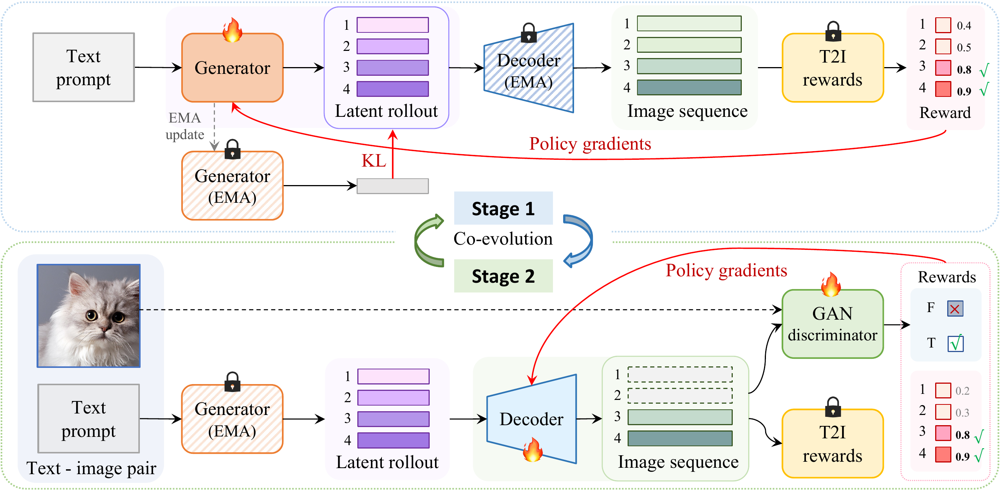

<div align="center">

# RankE

**End-to-End Post-Training for Discrete Text-to-Image Generation with Decoder Co-Evolution**

<a href="https://arxiv.org/abs/2605.21195"></a>
<a href="./LICENSE"></a>

</div>


## Overview

**RankE** is an end-to-end post-training framework for **discrete autoregressive text-to-image generation**. Instead of optimizing only the generator while keeping the decoder frozen, RankE introduces **decoder co-evolution** so that the generator and decoder can adapt together during post-training.

Key ideas of RankE include:

- **End-to-end post-training** for discrete text-to-image models.
- **Decoder co-evolution**, rather than a frozen decoder throughout RL/post-training.
- A **two-stage training design** that combines text-to-image rewards and pixel-level/discriminator-based supervision.
- Improved support for downstream evaluation on **COCO**, **GenEval**, and **HPSv2**.


<p align="center">
  
</p>

For the paper, see: [**arXiv**](https://arxiv.org/abs/2605.21195)

<!-- ## Highlights

- Cleaned public release of the **RankE post-training pipeline**.
- Training, sampling, and evaluation entry points for the paper workflow.
- Config-driven local path management via `configs/config.env`.
- Documentation for end-to-end usage and script references in `docs/`. -->

## Repository Structure

```text
RankE/
├── autoregressive/              # LlamaGen-side model, training, and sampling code
├── tokenizer/                   # Tokenizer, VQ, and loss modules
├── language/                    # Text encoding utilities
├── dataset/                     # Training data loading utilities
├── janus/                       # Janus-side model, training, and sampling code
├── evaluations/                 # COCO / GenEval / HPSv2 evaluation code
├── scripts/
│   ├── training_llamagen/
│   ├── sample_llamagen/
│   ├── eval_llamagen/
│   ├── training_janus/
│   ├── sample_janus/
│   └── eval_janus/
├── configs/
│   └── config.env.example       # Local environment/path template
├── docs/
│   ├── USAGE.md                 # End-to-end usage guide
│   └── SCRIPT_REFERENCE.md      # Public script reference
├── assets/
│   └── teaser.png               # README teaser figure
├── requirements.txt
├── requirements_janus.txt
└── README.md
```

## Quick Start

### 1. Install dependencies

We recommend using a fresh Python or Conda environment.

```bash
pip install -r requirements.txt
```

For the Janus pipeline, also review/install:

```bash
pip install -r requirements_janus.txt
```

### 2. Configure local paths

```bash
cp configs/config.env.example configs/config.env
```

Then edit the paths in `configs/config.env`, e.g.:

- `PROJECT_OUTPUT_ROOT`
- `PRETRAINED_ROOT`
- `VQ_CKPT_PATH`
- `GPT_CKPT_PATH_STAGE1`
- `JANUS_MODEL_PATH`
- `SCALING_BLIP3O_ROOT`
- `HPDV2_TRAIN_ROOT`
- `HPDV2_EVAL_ROOT`
- `COCO_REF_DIR`
- `GENEVAL_MASK2FORMER_PATH`
- `HPSV2_MODEL_PATH`

All public scripts read `configs/config.env` by default. You can override it with:

```bash
export RANKE_CONFIG_ENV=/path/to/config.env
```

## Main Workflows

### LlamaGen as example

**Training**
- `scripts/training_llamagen/train_clip_both.sh`
- `scripts/training_llamagen/train_hps_both.sh`

**Sampling**
- `scripts/sample_llamagen/sample_clip_coco.sh`
- `scripts/sample_llamagen/sample_clip_geneval.sh`
- `scripts/sample_llamagen/sample_hpsv2.sh`
- `scripts/sample_llamagen/sample_hps_geneval.sh`

**Evaluation**
- `scripts/eval_llamagen/eval_coco.sh`
- `scripts/eval_llamagen/eval_geneval.sh`
- `scripts/eval_llamagen/eval_hpsv2.sh`
- `scripts/eval_llamagen/eval_hps_geneval.sh`

<!-- ### Janus-Pro

**Training**
- `scripts/training_janus/train_clip_both.sh`
- `scripts/training_janus/train_hps_both.sh`

**Sampling**
- `scripts/sample_janus/sample_coco.sh`
- `scripts/sample_janus/sample_clip_geneval.sh`
- `scripts/sample_janus/sample_hpsv2.sh`
- `scripts/sample_janus/sample_hps_geneval.sh`

**Evaluation**
- `scripts/eval_janus/eval_coco.sh`
- `scripts/eval_janus/eval_clip_geneval.sh`
- `scripts/eval_janus/eval_hpsv2.sh`
- `scripts/eval_janus/eval_hps_geneval.sh` -->

## Recommended Usage

### LlamaGen workflow
1. Edit a training script under `scripts/training_llamagen/`.
2. Set the source checkpoint, scaling setup, reward weights, and optimization hyperparameters.
3. Launch training.
4. Put the resulting `RUN_NAME` into the matching sampling script.
5. Run sampling.
6. Run evaluation.

<!-- ### Janus-Pro workflow
1. Edit a training script under `scripts/training_janus/`.
2. Set `MODEL_TYPE="janus-pro"`, source checkpoint information, scaling setup, and training hyperparameters.
3. Launch training.
4. Put the resulting `RUN_NAME` into the matching sampling script.
5. Run sampling.
6. Run evaluation. -->

For more details, see:

- [`docs/USAGE.md`](docs/USAGE.md)
- [`docs/SCRIPT_REFERENCE.md`](docs/SCRIPT_REFERENCE.md)

<!-- ## Release Scope

This repository releases the **core codebase** for RankE post-training, including the public paths needed to:

- start from a base or SFT checkpoint,
- run RankE post-training,
- generate samples for **COCO**, **GenEval**, and **HPSv2**,
- evaluate the resulting models with the corresponding benchmarks.

The current release focuses on **post-training**, **sampling**, and **evaluation**. It does **not** aim to reproduce the full pretraining or full SFT stack. -->

 you will typically edit variables such as `RUN_NAME`, `STEPS`, `CFG_SCALE`, `CFG_LIST`, and `COMBO_ID` before launching them.
- Outputs are written under `${PROJECT_OUTPUT_ROOT}/...` by default.

<!-- ## License

This repository is a **code-only** release and is distributed under the [MIT License](LICENSE).

Since this repo builds on top of upstream projects, please also check the original licenses and usage terms for any external code, checkpoints, or models you use.

> No model checkpoints are distributed in this repository. If you use external checkpoints, follow the corresponding upstream model license terms. -->

## Citation

```bibtex
@article{jian2026ranke,
  title={RankE: End-to-End Post-Training for Discrete Text-to-Image Generation with Decoder Co-Evolution},
  author={Jian, Siyong and Li, Siyuan and Zhang, Luyuan and Wang, Zedong and Jin, Xin and Li, Ying and Tan, Cheng and Wang, Huan},
  journal={arXiv preprint arXiv:2605.21195},
  year={2026}
}
```

## Acknowledgements

This release includes RankE pipelines built on top of two autoregressive generation backbones:

- [**Janus-Pro**](https://github.com/deepseek-ai/janus)
- [**LlamaGen**](https://github.com/FoundationVision/LlamaGen)
